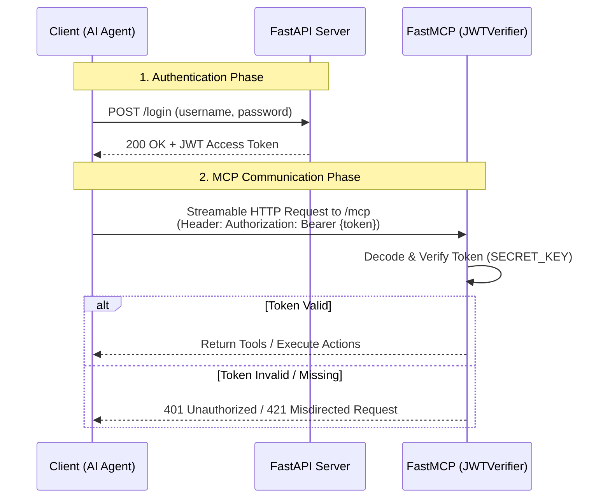

# FastMCP + FastAPI Example Project 🚀

This repository contains a client-server setup demonstrating the integration of the **Model Context Protocol (MCP)** using the `fastmcp` Python library, hosted within a **FastAPI** application with **JWT Authentication**.

## 📁 Structure
- `mcp_server/`: Contains the unified FastAPI & FastMCP server (`main.py`). It exposes a `/login` endpoint for authentication, standard REST APIs (like `/users/me`), and mounts the MCP tools under `/mcp`. Also contains a `docs/` folder for reading local files.
- `client/`: Contains the MCP Client (`main.py`) which first authenticates via HTTP to get a JWT token, and then connects to the server to invoke endpoints.

## 🚀 Features Demonstrated
1. **Hybrid FastAPI + FastMCP Server**:
   - Sharing Lifespans between FastAPI and FastMCP.
   - JWT Authentication (`TokenVerifier`) protecting both REST APIs and MCP Tools.
2. **Tools (`@mcp.tool`)**: 
   - Exposing functions that AI agents or clients can invoke (e.g., `add`, `list_employees`, `greet`).
3. **Resources (`@mcp.resource`)**:
   - Reading static and dynamic resources.
4. **Prompts (`@mcp.prompt`)**:
   - Serving predefined, parameterized prompts ready for LLM consumption.

## 🔐 Authentication Workflow

This project implements a unified JWT authentication mechanism where FastAPI handles the login logic (issuing tokens) and FastMCP validates them automatically.



## 📝 Prerequisites
- Python 3.10+
- Install dependencies:
```bash
pip install -r requirements.txt
```

## 🛠️ How to Run

### 1. Start the Server
Run the server script from the root directory:
```bash
python -m mcp_server.main
```
*The server will start listening on `http://127.0.0.1:8000`.*
- *FastAPI Docs (Swagger UI): `http://127.0.0.1:8000/docs`*
- *MCP Endpoint: `http://127.0.0.1:8000/mcp`*

### 2. Run the Client
Open a new terminal window and run the client script from the root directory:
```bash
python client/main.py
```
*The client will connect to the `/login` endpoint to get a Token, then connect to the MCP endpoint, list all available endpoints, and print the results.*

Enjoy building secure, context-aware AI tools!
